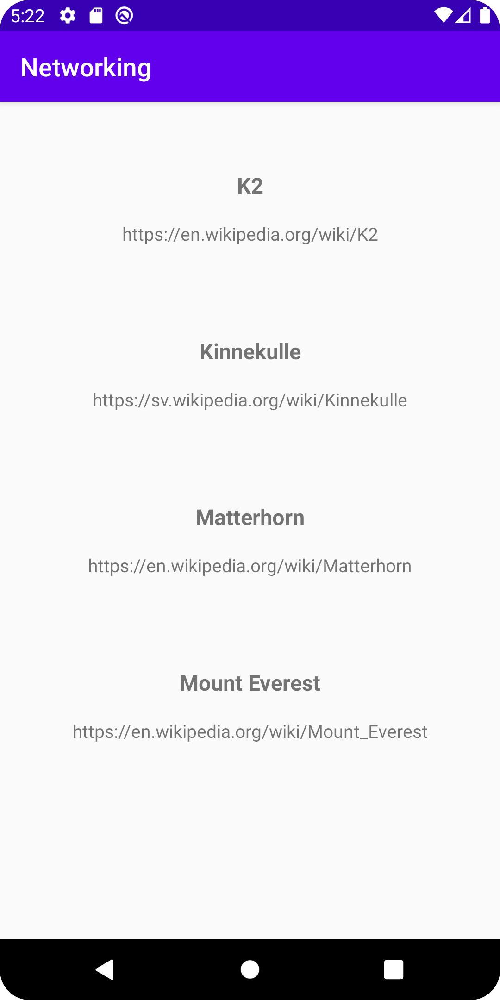

# Rapport 5: Networking

I `activity_main` skapades en __recyclerView__, denna associeras sedan med en variabel i `MainActivity` och aktiveras.  

````
<androidx.recyclerview.widget.RecyclerView
        android:id="@+id/recyclerView"                      // ges ett ID
        android:layout_width="match_parent"
        android:layout_height="match_parent"
        app:layout_constraintTop_toTopOf="parent"               // fyller ut längst med fönstret 
        app:layout_constraintBottom_toBottomOf="parent"         //
        app:layout_constraintStart_toStartOf="parent"           //
        app:layout_constraintEnd_toEndOf="parent"               //
        />
````

I JSON filen `mountain.json` börjar strängen med "[" vilket då betyder att det är en __array__, nästa tecken är ett "{" vilket visar starten på ett objekt, detta tolkas som att det måste finnas en array av objekt i filen, därför skapas först objektet i sig.
Objectet kommer att innehålla variabler relaterade till berg (enligt JSON-filen) därför döps classen till Mountain. Variabler skapas i klassen som översätts från JSON-filen. notera dock att i klassen skapas en instans av en annan klass, även denna måste skapas.

````
package com.example.networking;

public class Mountain {
    private String ID;
    private String name;
    private String type;
    private String company;
    private String location;
    private String category;
    private int size;
    private int cost;
    private Auxdata auxdata;       /// detta är ytterligare ett objekt som måste skapas

}
````
````
package com.example.networking;

public class Auxdata {
    private String wiki;
    private String img;
}
````
Slutligtviss så skapas den förstnämnda arrayen i `MainActivity`

````
  private ArrayList<Mountain> mountains;                /// arrayen deklareras och kommer innehålla data av typen Mountain (Klassen som precis skapades) 

    @Override
    protected void onCreate(Bundle savedInstanceState) {
        super.onCreate(savedInstanceState);
        setContentView(R.layout.activity_main);

        mountains = new ArrayList<>();                  /// arrayen initieras som en medlems variabel 
        new JsonFile(this, this).execute(JSON_FILE);
    }
````

För att fylla ArrayListen använder vi oss av JSON och GSON, både en internt och externt JSON kommer att genomgå en "Unmarshalling" med hjälp av GSON för att omvandlas från en textsträng till ett objekt ( en lista av objekt i denna uppgift).

```
        //i onCreate, endast en av dessa används åt gången 
        
        new JsonFile(this, this).execute(JSON_FILE);      // intern jason
        new JsonTask(this).execute(JSON_URL);             // extern url jason
                                                          // används för att ladda ner JSON stängen. för att detta ska fungera måste tillgång till internet vara aktiverat

```        

```             
   @Override
    public void onPostExecute(String json)
    {
        Gson gson = new Gson();                                     // en instans av gson skapas

        Type type = new TypeToken <List<Mountain>>() {}.getType();  //  sedan listan av objekt
        mountains = gson.fromJson( json, type);                     // 
        Log.d("MainActivity",json);
                                                                    // eftersom att JsonTask använder AsyncTask och således inte kan garanterat köras innan adaptern skapas behöver en setter skapas 
                                                                    // som kan ändra innehållet av listan i efterhand. När det händer behöver adpaptern meddelas om uppdateringen. 
                                                                                
        mountainAdapter.setMountains(mountains);                    // uppdaterar listan i adaptern
        mountainAdapter.notifyDataSetChanged();                     // meddelar om att den uppdaterats

    }
```
En RecyclerView adapter class skapas, och initieras i `MainActivity` denna kommer att agera mellanhand för recyclern och innehållet.
````
private void setAdapter(){

        mountainAdapter = new RecyclerViewAdapterMountain(mountains);
        RecyclerView.LayoutManager  layoutManager = new LinearLayoutManager(getApplicationContext());
        recyclerView.setLayoutManager(layoutManager);
        recyclerView.setAdapter(mountainAdapter);
    }
````

````
public class RecyclerViewAdapterMountain extends RecyclerView.Adapter<RecyclerViewAdapterMountain.ViewHolder> {

    ArrayList<Mountain> mountains;


    public RecyclerViewAdapterMountain(ArrayList<Mountain> mountains) {
        this.mountains = mountains;
    }


    public static class ViewHolder extends RecyclerView.ViewHolder {                // De Views som valts för recyclerViewn associeras med variabler via deras id.
        private TextView mountainName;
        private TextView mountainUrl;

        public ViewHolder(@NonNull View view) {                    
            super(view);

            mountainName = view.findViewById(R.id.mountain_name);
            mountainUrl = view.findViewById(R.id.Url);
        }
    }


    @NonNull
    @Override
    public RecyclerViewAdapterMountain.ViewHolder onCreateViewHolder(@NonNull ViewGroup parent, int viewType) {      // layouten i `list_item` sätts för varje ny rad

        View itemView = LayoutInflater.from(parent.getContext()).inflate(R.layout.list_item, parent, false);

        return new ViewHolder(itemView);
    }

    @Override
    public void onBindViewHolder(@NonNull RecyclerViewAdapterMountain.ViewHolder holder, int position) {    // De Views som inte är konstanter och är en del av recyclern får innehållet satt här
         Mountain mountain = mountains.get(position);
         holder.mountainName.setText(mountain.getName());
         holder.mountainUrl.setText(mountain.getAuxdata().getWiki());
    }

    @Override
    public int getItemCount() {  // Den totala storleken av listan
        return mountains.size();
    }
    public void setMountains(ArrayList<Mountain> mountains) {      // här sätts innehållet för listan (när den anropas)
        this.mountains = mountains;

    }
}

````
En ny android resursfil skapades där en basic layout med textViews implemeterades, denna kommer att användas som en "rad" i recyclerviewn. dessa textViews kommer att få ny information för varje instans av denna layout




